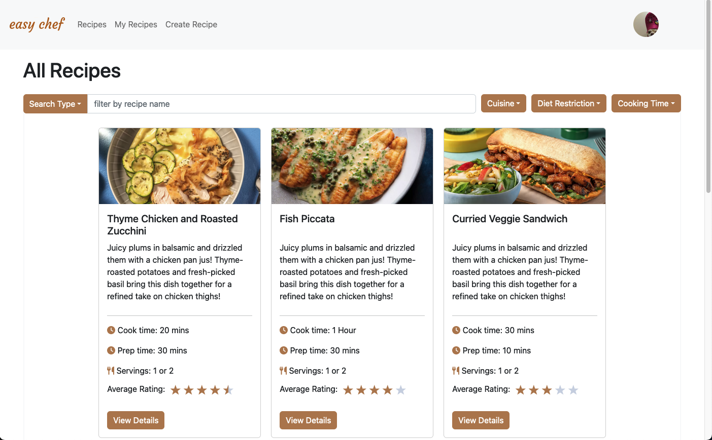
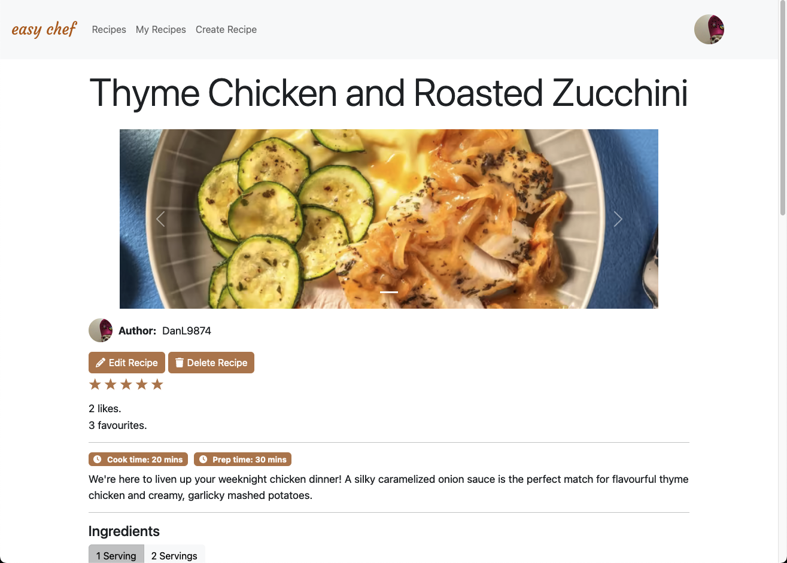
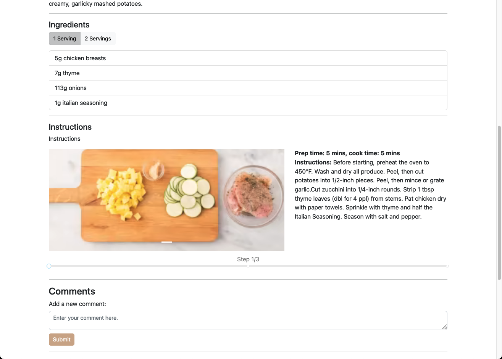
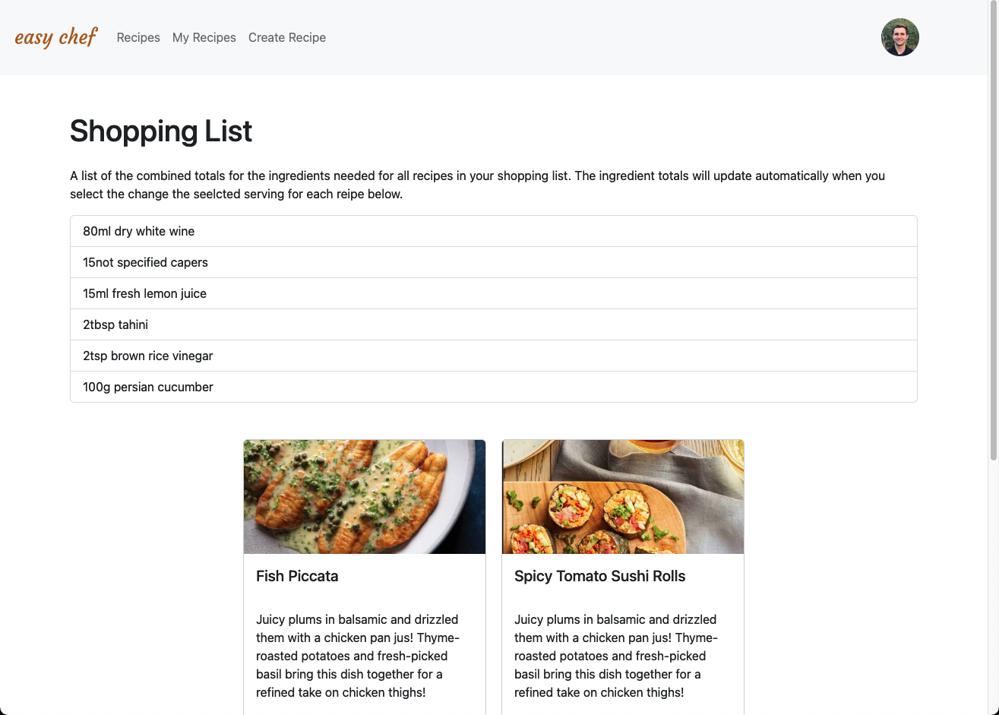
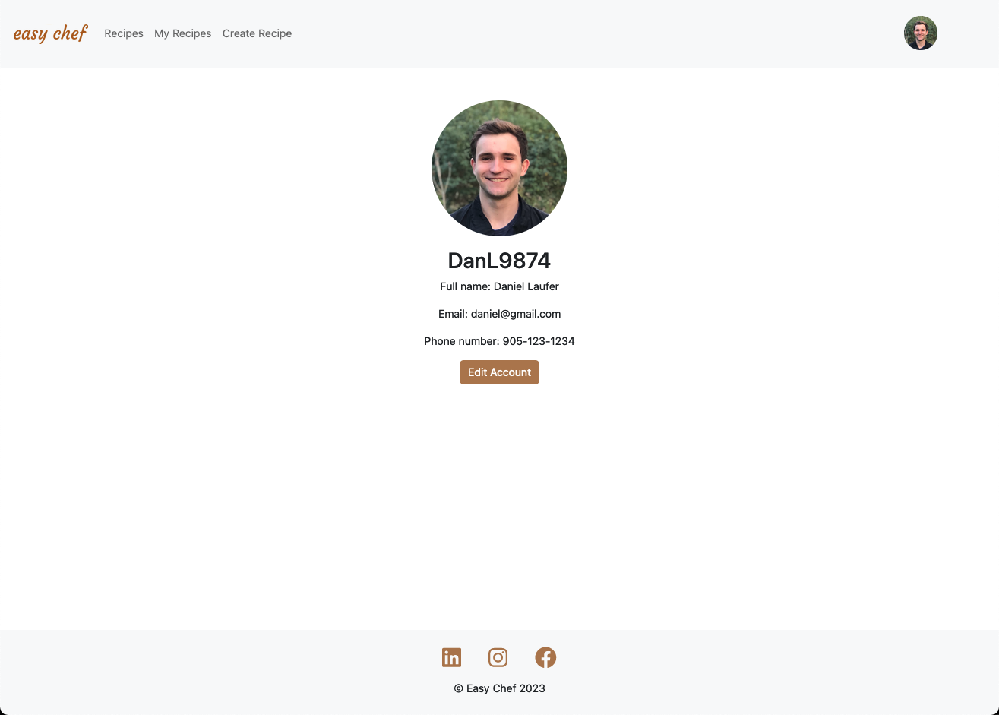

# Easy Chef

Search through millions of different recipes from various diets and ingredients from all over the world! You can also share your custom recipe with everyone. You don't need to worry about the shopping list either; Easy Chef takes care of that as well!

Created by Daniel Laufer using React and the Django Rest Framework.

## Installation/Setup
1. To set up virtual environments and install dependencies run `source ./startup.sh`
2. To start up both the front-end and back-end run `./run.sh`

After running the second command above, the React front-end will be accessible at http://localhost:5173 and the Django back-end server will be running at http://localhost:8000. You can view the back-end Swagger docs at http://localhost:8000/docs. 

## Screenshots

